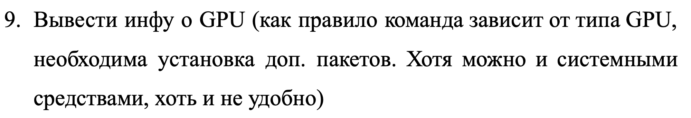

# Лабораторная работа по операционным системам

---

# Оглавление:

---

- [System info](#категория-system-info)
  - [RAM](#ram)
  - [Disk Usage](#disk-usage)
  - [GPU (optional)](#gpu-optional)
  - [Network](#network)
- [Grep](#категория-grep)
- [Bash](#категория-bash)

---

# Задачи:

## Категория: System info

### RAM


> Answer:
>
> RAM (Random Access Memory) - память с произовльным доступам.
> Оперативная память <=> RAM;
> Оперативная память - энергозависимая часть системы компьютерной памяти, в которой во время работы компьютера хранится выполняемый машинный код (программы), а также входные, выходные и промежуточные данные, обрабатываемые процессором.
>
> SWAP – один из механизмов виртуальной памяти, при котором отдельные фрагменты памяти (обычно неактивные) перемещаются из ОЗУ (1) во вторичное хранилище (отдельный раздел или файл), освобождая ОЗУ (1) для загрузки других активных фрагментов памяти.
> P.S. Дополнительно SWAP используется при организации режима сна. При этом в SWAP сохраняется образ оперативной памяти. 
>
> (1) ОЗУ (Оперативное запоминающее устройство) — техническое устройство, реализующее функции оперативной памяти. ОЗУ может изготавливаться как отдельный внешний модуль или располагаться на одном кристалле с процессором, например, в однокристальных ЭВМ или однокристальных микроконтроллерах.


> Answer:
>
> - Чтобы узнать объём RAM надо ввести в терминале команду: 
> ``` 
> $ system_profiler SPHardwareDataType | grep "Memory:" 
>       Memory: 8 GB
> ```
> - Чтобы узнать объём Swap надо ввести в терминале команду:
> ```
> $ sysctl vm.swapusage 
> vm.swapusage: total = 1024,00M  used = 154,00M  free = 870,00M  (encrypted)
> ```


> Answer:
> ```
> $ system_profiler SPHardwareDataType 
> Hardware:
> 
>    Hardware Overview:
>       Model Name: MacBook Air
>       Model Identifier: MacBookAir10,1
>       Chip: Apple M1
>       Total Number of Cores: 8 (4 performance and 4 efficiency)
>       Memory: 8 GB
>       System Firmware Version: 6723.140.2
>       OS Loader Version: 6723.140.2
>       Serial Number (system): .....
>       Hardware UUID: .....
>       Provisioning UDID: .....
>       Activation Lock Status: Disabled
> ```

### Disk Usage


> Answer:
> 
> Чтобы узнать информацию о дисках следует ввести следующую команду: 
> ```
> $ df -h
> Filesystem       Size   Used  Avail Capacity iused      ifree %iused  Mounted on
> /dev/disk3s1s1  228Gi   21Gi   95Gi    18%  553788 2393071172    0%   /
> devfs           201Ki  201Ki    0Bi   100%     694          0  100%   /dev
> /dev/disk3s6    228Gi  1.0Gi   95Gi     2%       1 2393624959    0%   /System/Volumes/VM
> /dev/disk3s2    228Gi  360Mi   95Gi     1%     814 2393624146    0%   /System/Volumes/Preboot
> /dev/disk3s4    228Gi  590Mi   95Gi     1%     213 2393624747    0%   /System/Volumes/Update
> /dev/disk1s2    500Mi  6.0Mi  481Mi     2%       3    5119997    0%   /System/Volumes/xarts
> /dev/disk1s1    500Mi  7.5Mi  481Mi     2%      45    5119955    0%   /System/Volumes/iSCPreboot
> /dev/disk1s3    500Mi  652Ki  481Mi     1%      36    5119964    0%   /System/Volumes/Hardware
> /dev/disk3s5    228Gi  109Gi   95Gi    54% 1340445 2392284515    0%   /System/Volumes/Data
> map auto_home     0Bi    0Bi    0Bi   100%       0          0  100%   /System/Volumes/Data/home
> /dev/disk2s1    5.0Gi  1.9Gi  3.1Gi    38%      60   52428300    0%   /System/Volumes/Update/SFR/mnt1
> /dev/disk3s1    228Gi   21Gi   95Gi    18%  553607 2393071353    0%   /System/Volumes/Update/mnt1
> ```


> Answer:
> 
> Чтобы узнать размер home директории (у меня она называется `/Users/tv`), стоит ввести следующую команду:
> ```
> $ du -h /Users/tv
> ...
> 10M	/Users/tv/Downloads
> 4,0K	/Users/tv/.continuum/anaconda-client
> 4,0K	/Users/tv/.continuum
> 0B	/Users/tv/.cache
> 4,7M	/Users/tv/.zsh_sessions
> 0B	/Users/tv/.conda
> 33G	/Users/tv
> ```
> P.S. Данная команда выведет размер всех файлов, а в конце и размер нужной нам директории


> Answer:
> 
> Чтобы увидеть всю информацию о запущенных процессов, стоит ввести команду: 
> ```
> $ top
> Processes: 378 total, 2 running, 376 sleeping, 1845 threads                                                   17:08:53
> Load Avg: 1.32, 1.54, 1.46  CPU usage: 3.56% user, 2.73% sys, 93.69% idle
> SharedLibs: 278M resident, 56M data, 14M linkedit.
> MemRegions: 106755 total, 1651M resident, 62M private, 1481M shared. PhysMem: 7365M used (1229M wired), 176M unused.
> VM: 144T vsize, 3272M framework vsize, 625659(0) swapins, 791315(0) swapouts.
> Networks: packets: 28973824/35G in, 21836459/2668M out. Disks: 19429304/591G read, 14406816/219G written.
>
> PID    COMMAND      %CPU TIME     #TH    #WQ  #PORT MEM    PURG   CMPRS  PGRP  PPID  STATE    BOOSTS           %CPU_ME
> 65141  Terminal     14.9 01:41.16 9      3    307   207M-  40M    80M    65141 1     sleeping *0[913+]         0.38457
> 347    WindowServer 10.1 08:22:24 20     6    3124  1779M  14M    429M   347   1     sleeping *0[1]            0.25581
> 0      kernel_task  9.0  05:57:23 452/8  0    0     33M    0B     0B     0     0     running   0[0]            0.00000
> 65112  Google Chrom 4.5  08:43.79 23     1    823   373M+  0B     214M-  64039 64039 sleeping *0[7]            0.00000
> 66425  top          4.3  00:01.12 1/1    0    26    4769K  0B     0B     66425 65143 running  *0[1]            0.00000
> 65554  clion        2.2  14:45.36 103    5    629   1660M+ 192K   445M-  65554 1     sleeping *0[1287]         0.00000
> ...
> ```

### GPU (optional)



> Answer:
> 
> Чтобы узнать информацию о производительности GPU стоит ввести команду:
> ```
> $ sudo powermetrics --samplers gpu_power -i500 -n1
> ...
> **** GPU usage ****
>
> GPU active frequency: 396 MHz
> GPU active residency:   5.51% (396 MHz: 5.5% 528 MHz:   0% 720 MHz:   0% 924 MHz:   0% 1128 MHz:   0% 1278 MHz:   0%)
> GPU requested frequency: (396 MHz: 5.5% 528 MHz:   0% 720 MHz:   0% 924 MHz:   0% 1128 MHz:   0% 1278 MHz:   0%)
> GPU idle residency:  94.49%
> GPU Power: 14 mW
> ```


### Network


> Answer:
> 
> Можно выделить три ip-адреса:
> - Внутренний адрес (IP-адрес компьютера);
> - Адрес в локальной сети;
> - Внешний IP доступный во всём интернете.
> 
> Чтобы посмотреть внутренний ip-адрес компьютера, нужно ввести команду:
> ```
> $ nslookup localhost
> Server:		192.168.0.1
> Address:	192.168.0.1#53
>
> Name:	localhost
> Address: 127.0.0.1
> ```
> 
> Чтобы узнать внешний ip-адрес, используйте команду:
> ```
> $ wget -qO- eth0.me 
>```


> Answer:
> Чтобы узнать mac-адрес, следует ввести команду:
> ```
> $ ifconfig en0 | grep "ether"
> ```


> Answer:
> 
> Второй способ посмотреть ip-адрес:
> ```
> $ ifconfig | grep "inet" 
>   inet 127.0.0.1 netmask 0xff000000 
>   inet6 ::1 prefixlen 128 
>   inet6 fe80::1%lo0 prefixlen 64 scopeid 0x1 
>   inet6 fe80::1c00:6bff:fe1e:cb65%anpi1 prefixlen 64 scopeid 0x4 
>   inet6 fe80::1c00:6bff:fe1e:cb64%anpi0 prefixlen 64 scopeid 0x5 
>   inet6 fe80::182e:46ac:ed65:6769%en0 prefixlen 64 secured scopeid 0xc 
>   inet 192.168.0.3 netmask 0xffffff00 broadcast 192.168.0.255
>   inet6 fe80::2420:b4ff:fe22:c6e3%awdl0 prefixlen 64 scopeid 0xd 
>   inet6 fe80::2420:b4ff:fe22:c6e3%llw0 prefixlen 64 scopeid 0xe 
>   inet6 fe80::fb40:918b:484d:f59b%utun0 prefixlen 64 scopeid 0xf 
>   inet6 fe80::3104:36fc:467d:a31a%utun1 prefixlen 64 scopeid 0x10 
> ```

## Категория: Grep


> Answer:
> 
> `Grep` - утилита командной строки, которая даёт пользователям возможность вести поиск строки. С его помощью можно даже искать конкретные слова в файле.
>
> i. Чтобы найти паттерн в файле, нужно воспользоваться данным синтаксисом:
> ```
> $ grep "pattern" file.txt
> ```
> P.S. В примере выше, мы ведём поиск слова/словосочетания `pattern` в файле `file.txt`
> 
> ---
> ii. Чтобы запустить поиск паттерна сразу по нескольким файлам, нужно воспользоваться данным синтаксисом:
> ```
>  grep "pattern" file1.txt file2.txt 
> ```
> ```
>  grep "pattern" /dir*
> ```
> P.S. Чтобы производить поиск по нескольким файлам нужно просто передать эти файлым через пробел. Если хотите начать поиск по всем файлам в директории, то следует указать директории и поставить символ `*`, как во втором примере. В первом примере выше, мы произведём поиск слова/словосочетания `pattern` по файлам `file1.txt`, `file2.txt`
> 
> ---
> iii. Чтобы вести поиск нескольких паттернов в одном/нескольких файлов, нужно воспользоваться данным синтаксисом:
> ```
> $ grep -e "pattern1" -e "pattern2" file.txt
> ```
> ```
> $ grep "pattern1\|pattern2" file1.txt file2.txt
> ```
> P.S. Чтобы в grep передать несколько паттернов, нужно передавать каждый с флагом `-e` или же просто через or [`|`] (при этом надо обязательно логический оператор экранировать). В первом примере мы ведём поиск по файлу `file.txt`, а во втором по двум файлам `file1.txt` и `file2.txt`.


> Answer:
> 
> Чтобы производить поиск паттерна и при этом не обращать внимание на регистр нужно передать команде `grep` флаг `-i`:
> ```
> $ grep -i "pattern" file.txt
> ```


> Answer:
> 
> Чтобы найти паттерн точь-в-точь нужно передать команде `grep` флаг `-w`:
> ```
> grep -w "pattern" test.txt
> ```
> P.S. Найдёт точное совпадения слова/словосочетания `pattern` в файле `test.txt`


> Answer:
>
> Чтобы вывести все строки в файле не содержащие паттерн нужно передать команде `grep` флаг `-v`:
> ```
>  $ grep -v "pattern" file.txt
> ```
> P.S. Команда выше выведет все строки из файла `file.txt`, которые не содержат слово/словосочетание `pattern`


> Answer:
>
> Чтобы найти все `info` файлы, нужно передать вывод директории в grep и сделать поиск по паттерну:
> ```
> $ ls /proc | grep "info"
> ```


> Answer: 
> 
> Чтобы вывести номер строки в котором нашёлся паттерн нужно запустить команду `grep` с флагом `-n`
> ```
> $ grep -n "pattern" file.txt
> ```


> Answer:
> 
> Базовый regex синтаксис:
>
> | Символ регулярного выражения | Описание                                                                                                                                                                                  |
> |:----------------------------:|-------------------------------------------------------------------------------------------------------------------------------------------------------------------------------------------|
> | *                            | Допускается любое количество предшествующих символов (например .*, будет соответствовать любой однострочной строке, включая пустую строку, и часто используется)                          |
> | .                            | Соответствует любому одиночному символу (обычно кроме новой строки)                                                                                                                       |
> | ?                            | Предшествующий символ может присутствовать или отсутствовать (например /hell?o/, будет соответствовать hello или helo)                                                                     |
> | /                            | Экранирование специального символа (например \., соответствует буквальной точке)                                                                                                          |
> | +                            | Один или несколько предшествующих символов ( .+то же самое, что и .*за исключением того, что он не будет соответствовать пустой строке)                                                   |
> | &#124;                       | «или» соответствует предыдущему разделу или следующему разделу (например hello\ &#124; mad, соответствует «привет» или «безумный»)                                                               |
> | ()                           | сгруппировать раздел вместе. Это может быть полезно для условных выражений ( (a\ &#124; b)), множителей ( (hello)+) или для создания групп для замен (см. ниже).                                 |
> | {}                           | Укажите, сколько предшествующих символов (например a{12}, соответствует 12 символам «а» подряд)                                                                                           |
> | []                           | Сопоставьте любой символ в этом наборе. -определяет диапазоны (например [a-z], любая строчная буква), ^означает «не» (например , [^,]+соответствует любому количеству незапятых в строке) |
> | ^                            | Начало строки                                                                                                                                                                             |
> | $                            | Конец линии                                                                                                                                                                               |


> Answer:
>
> ```
> $ ls /lib | grep ".so"
> ```
>```
> $ ls /lib | grep -rlw ".so" *
> ```
>
>P.S. Для того, чтобы вывести все файлы в директории с расширением `.so` нужно передать на вход команде `grep` вывод команды `ls` и сделать обычный поиск по паттерну, как демонстрируется в первом примере. А чтобы запустить рекурсивный поиск нужно передать в команду `grep` флаг `r`.


> Answer:
>
> Чтобы найти все электронные адреса, дадим на вход команде `grep` содержимое файлов, затем найдём слова в которых встречается символ `@` и выделим его красным цветом.
> 
>Пример:
> ```
> $ cat Emails.csv | grep --color=auto -n "@"
> ```


> Answer:
>
> Чтобы добавить наш паттерн из файла, сначала мы создадим переменную `pattern` в которую считаем наш паттерн из файла, затем пайпом выполним вывод данных из файла и направим его в команду `grep`, в которую подставим нашу считанную переменную из файла вместо аргумента паттерна. 
> 
> Пример:
> ```
> export pattern=$(cat pattern.txt) | cat Emails.csv | grep --color=auto -n "$pattern"
> ```


> Answer:
> 
> Чтобы вывести все процессы запущенные пользователем `UserName`, сначала подадим `grep` на вход все процессы, из них уже с помощью `grep` выберем те, которые содержат имя нашего пользователя `UserName` 
> 
> Пример:
> ```
> ps aux | grep "UserName"
> ```

## Категория: Bash


> Код [файл `scripts/ehw.sh`]:
> ```
> #!/bin/sh
>
> echo "Hello World!"
> ```
> 
> P.S. 
>
> Чтобы запустить этот скрипт в терминале установим ему права с помощью команды `chmod`:
> ```
> $ chmod 755 ehw.sh
> ```
> Затем запустим: 
> ```
> $ ./ehw.sh 
> Hello World!
> ```


> Код [файл `scripts/existence.sh`]:
> ```
> #!/bin/sh
>
> path=""
> object=""
>
> echo "Введите путь к файлу/директории [Если хотите искать в директории, в которой находитесь, введите просто . ]: "
> read path
> echo "Введите название объекта: "
> read object
> 
> out=$(find $path -name "*$object*")
> if [[ "$out" = "" ]]
> then
>   echo "Файл не найден!"
> else
>   echo $out
> fi
> ```


> Answer:
> 
> Ссылка на гит репозиторий проекта, где консольное приложение используется как утилита:
> - https://github.com/Tsygankov-Slava/Calculator